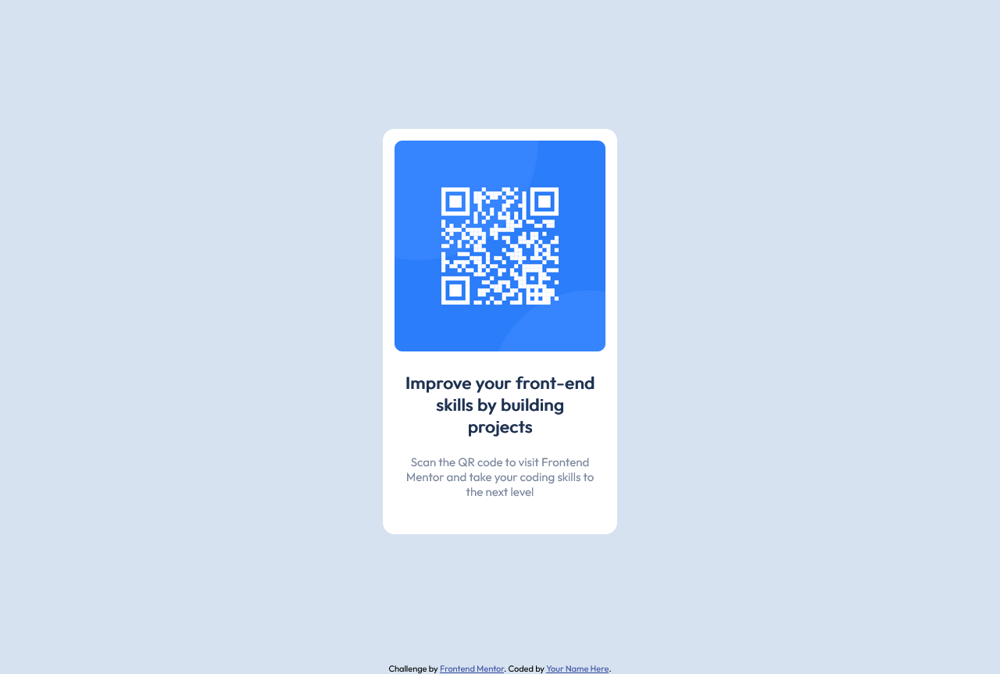

# Frontend Mentor - QR code component solution

This is a solution to the [QR code component challenge on Frontend Mentor](https://www.frontendmentor.io/challenges/qr-code-component-iux_sIO_H). Frontend Mentor challenges help you improve your coding skills by building realistic projects. 

## Table of contents

- [Overview](#overview)
  - [Screenshot](#screenshot)
  - [Links](#links)
- [My process](#my-process)
  - [Built with](#built-with)
  - [What I learned](#what-i-learned)
  - [Continued development](#continued-development)
  - [Useful resources](#useful-resources)
- [Author](#author)
- [Acknowledgments](#acknowledgments)


## Overview

### Screenshot




### Links

- Solution URL: [Add solution URL here](https://your-solution-url.com)
- Live Site URL: [Add live site URL here](https://your-live-site-url.com)

## My process

Firstly, i figured out how many div's i would need. 

then i marked down all the html tag

Lastly i added the css to the html 

### Built with

- Semantic HTML5 markup
- CSS custom properties
- Flexbox
- Mobile-first workflow


### What I learned

I learnt how colors mathc with each other perfectly. also about positioning correctly and making the site to look good in mobile as well

### Continued development
```css
body {
    margin: 0;
    padding: 0;
    background-color: var(--Light-gray);
    vertical-align: middle;
    min-height: 100vh;
    display: flex;
    flex-direction: column;
    justify-content: center;
    font-family: var(--font-family);
}
```

the way to align all the components to the middle of the screen

### Useful resources

- [stackoverflow](https://stackoverflow.com/a/6464733) - centering all elements in the body to the middle of the screen

## Author

- Frontend Mentor - [@Mr-jaw](https://www.frontendmentor.io/profile/Mr-jaw)

